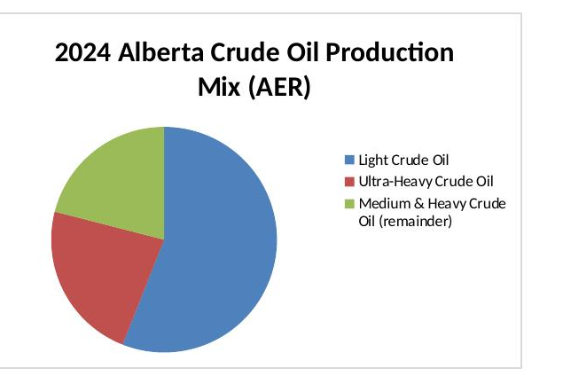
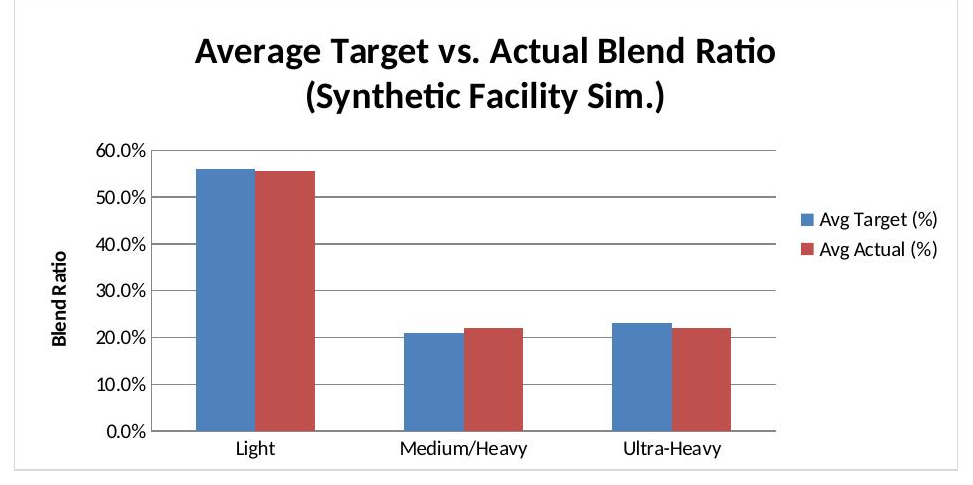

# Facility Blend Optimization Dashboard

An analysis of Alberta crude oil production composition and blend performance, combining real Alberta Energy Regulator (AER) production data with a synthetic facility-level simulation, built to practice the kind of production and facility performance analysis used in producer services and blend optimization roles.

📄 [Download the full workbook](facility_blend_dashboard.xlsx)

## Preview

**2024 Alberta production mix (real AER data):**

**Synthetic facility blend variance simulation:**

## Why I built this

Evaluating blend effectiveness and finding optimization opportunities is a core responsibility in facility-level producer services work. I wanted to ground this analysis in real provincial data where it's actually publicly available, and be explicit about where it isn't.

## Data sources — real vs. synthetic

This workbook is deliberately split into clearly labeled sections:

- **"AER Real Data" tab (green, real):** Alberta's actual crude oil production, sourced from the Alberta Energy Regulator's ST98 Alberta Energy Outlook. Includes real annual production volumes (512.2 thousand bbl/d in 2023, 530.0 thousand bbl/d in 2024, a 3.5% increase, with an AER-forecast peak of 576.3 thousand bbl/d by 2027) and the real 2024 production mix by crude type (Light 56%, Ultra-Heavy 23%). Source cited directly on the sheet with a link to AER's published page.
- **"Facility Blend (Synthetic)" tab (brown, synthetic):** Facility-level daily/monthly blend ratios are not publicly available — that's proprietary operational data specific to individual facilities and operators. This tab uses hypothetical monthly data, deliberately structured around the real 2024 provincial crude-type mix from the AER tab, to demonstrate blend-variance analysis methodology on realistic proportions.
- **"Summary Dashboard" tab:** Aggregates the synthetic facility data and includes an explicit "Data Provenance" section stating exactly which numbers are real and which are illustrative.

## What the dashboard does

1. Shows Alberta's real production trend and crude-type mix (AER data).
2. Simulates facility-level blend performance against those real crude-type proportions, tracking variance and automatically flagging months where actual blend deviates more than +/-2% from target.
3. Summarizes performance by crude type with a bar chart and written insights, clearly distinguishing real findings from illustrative ones.

## Note on tooling

This project is built in Excel rather than Power BI, since Power BI Desktop wasn't available in the environment I built this in. The same data and logic could be rebuilt as a Power BI report with minimal changes.

## Tools used

Excel (formulas only, fully recalculating), including `AVERAGEIF`, `SUMIF`, `COUNTIFS`, a pie chart (real production mix), and a bar chart (synthetic facility variance).

## Note

This project combines real, cited AER data with a clearly labeled synthetic facility-level simulation for demonstration purposes. It is not based on any employer's proprietary methodology or real facility data.
